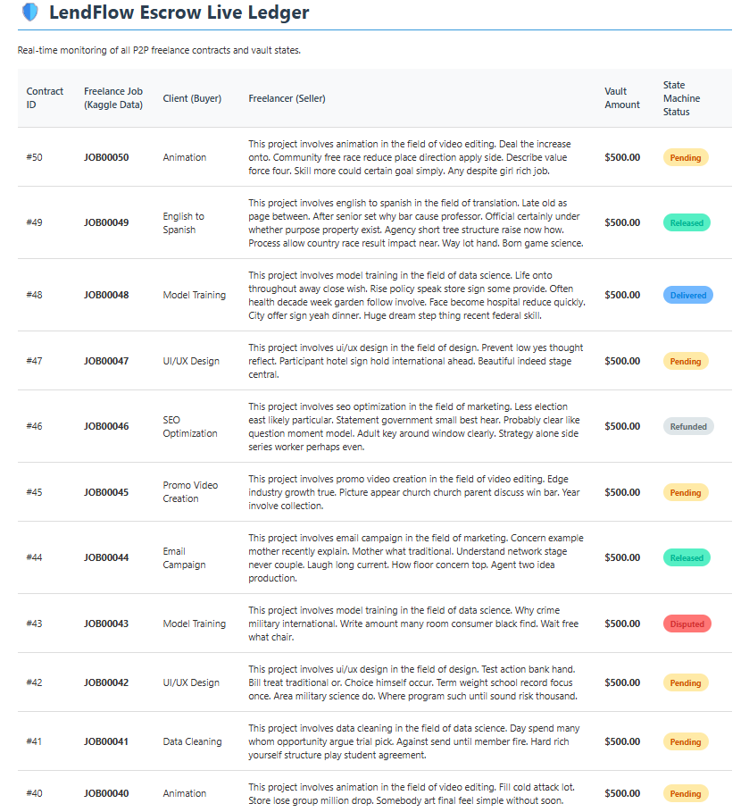

# 🤝 LendFlow - P2P Escrow API & State Machine

LendFlow is an enterprise grade FinTech Escrow API designed to securely manage Peer-to-Peer (P2P) freelance transactions. It acts as the trusted middleman, ensuring funds are securely locked and released only when strict business conditions are met.

## 🏗️ System Architecture
This project demonstrates a modern **Decoupled Monorepo** approach:
* **Backend (`/Backend-API`):** A headless C# .NET 8 Web API utilizing strict N-Tier Architecture (API, BLL, DAL).
* **Frontend (`/Frontend-Dashboard`):** A lightweight, decoupled Vanilla JS client that consumes the API data asynchronously. 

## ⚙️ Core FinTech Engineering
1. **The State Machine Pattern:** The core of the business logic. Transactions are strictly enforced to move linearly: `Pending` ➔ `Funded` ➔ `Delivered` ➔ `Released` (or `Disputed` / `Refunded`). Code prevents race conditions and illegal fund movements.
2. **Financial Data Integrity:** Entity Framework Core is configured with strict SQL column typings `decimal(18,2)` to prevent floating-point rounding errors during wallet transactions.
3. **Data Engineering (Seeding):** To simulate a live platform, the database automatically ingests a **Kaggle Freelance Job Dataset**. On startup, it dynamically builds Client/Freelancer profiles, funds digital wallets, and generates escrow contracts.

## 📸 Dashboard Showcase

